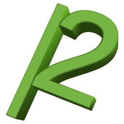

# *Rascal* 

**Table of contents**
*   [Definition](#definition)
*   [Details](#details)
*   [Usage](#usage)
*   [Requirements](#requirements)
*   [Contact](#contact)
*   [Useless facts](#useless-facts)

----

## Definition

The *Rascal* project is a simple string manipulation tool that replaces letters, numbers and further characters with random user-defined ones.

[Top](#rascal-)

## Details

A few years ago, I developed a project called *1337 Converter* just for fun, which simply converted text into leetspeak. Quite some people used it to strengthen their passwords consisting of words to avoid or at least complicate dictionary attacks.

For example, the password `maverick` was converted to `[V]4vE|2!(k`.

So, in first place, *Rascal* is (or has become) a password scrambler to strengthen weak passwords based on words by replacing their letters, numbers and further characters with random resembling user-defined ones. Of course, it still works as text-to-leetspeak converter as well.

[Top](#rascal-)

## Usage

In the `docs` sub-directory of the project, there are plain text files containing a detailed documentation for each component with further information and usage examples.

[Top](#rascal-)

## Requirements

In order to run *Rascal*, the *Python* framework must be installed on the system.

Depending on which version of the framework you are using:

*   *Python* 2.x (version 2.7 or higher is recommended, may also work with earlier versions)
*   *Python* 3.x (version 3.2 or higher is recommended, may also work with earlier versions)

[Top](#rascal-)

## Contact

Any suggestions, questions, bugs to report or feedback to give?

You can contact me by sending an email to [dev@urbanware.org](mailto:dev@urbanware.org).

## Useless facts

*   The project name is an abbreviation for ***Ra**ndom* ***S**tring* ***C**haracter* ***Al**teration*.
*   The first version uploaded on *GitHub* was *Rascal* 1.0.4 built on April 14th, 2018.
*   Before uploading, the project has neither been changed nor even touched for more than three years.

[Top](#rascal-)
